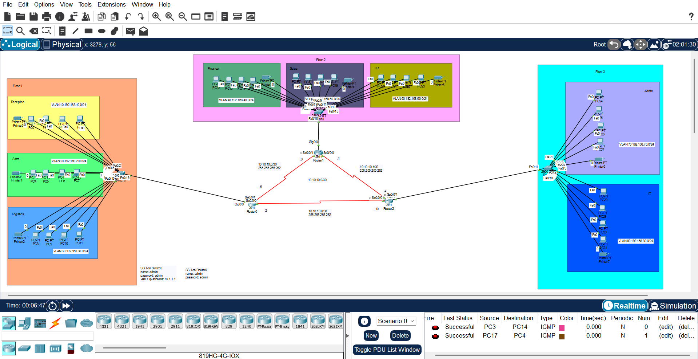

# NTI Network Infrastructure Final Project

This repository contains my final project for the Network Infrastructure and Security Training at the National Telecommunications Institute (NTI). This project served as a comprehensive review and practical application of key networking concepts I had previously learned, with a focus on implementing enterprise-grade network infrastructure for a multi-department organization.

## Project Overview

I designed and implemented a complete network infrastructure for a company with 3 floors and 8 departments using Cisco networking equipment. The project demonstrates practical application of various networking protocols and technologies in a simulated enterprise environment.



### Technologies Implemented

- **OSPF, SSH, and Telnet protocols**
- **VLANs & Inter-VLAN routing**
- **DHCP & network segmentation**
- **Subnetting & network design**
- **Static, default, and dynamic routing**
- **Access Control Lists (ACLs)**
- **Troubleshooting & optimization**

### Core Networking Concepts

- Switching and VLAN configuration
- IPv4 addressing and subnetting
- Inter-VLAN routing
- ACL implementation
- Remote management (Telnet and SSH)
- OSPF dynamic routing protocol
- DHCP services
- DNS configuration
- Static and default routing
- Network Address Translation (NAT)

## Network Design

The network infrastructure consists of:

- **3 Routers** (R0, R1, R2) handling inter-VLAN routing and connectivity
- **3 Switches** (S0, S1, S2) providing departmental connectivity
- **8 VLANs** representing different departments:
  - VLAN 10: Reception
  - VLAN 20: Store
  - VLAN 30: Logistics
  - VLAN 40: Finance
  - VLAN 50: Sales
  - VLAN 60: HR
  - VLAN 70: Admin
  - VLAN 80: IT

## Configuration Steps

### 1. Switch Configuration

#### Switch 0 (S0) Configuration:
```cisco
enable
configure terminal
vlan 10
name Reception
vlan 20
name Store
vlan 30
name Logistics
exit
interface range fastethernet0/1-5
switchport mode access
switchport access vlan 10
exit
interface range fastethernet0/6-10
switchport mode access
switchport access vlan 20
exit
interface range fastethernet0/11-15
switchport mode access
switchport access vlan 30
exit
hostname S0
interface fastethernet0/16
switchport mode trunk
exit
```

#### Switch 1 (S1) Configuration:
```cisco
enable
configure terminal
vlan 40
name Finance
vlan 50
name Sales
vlan 60
name HR
exit
interface range fastethernet0/1-5
switchport mode access
switchport access vlan 40
exit
interface range fastethernet0/6-10
switchport mode access
switchport access vlan 50
exit
interface range fastethernet0/11-15
switchport mode access
switchport access vlan 60
exit
```

#### Switch 2 (S2) Configuration:
```cisco
enable
configure terminal
vlan 70
name Admin
vlan 80
name IT
exit
interface range fastethernet0/1-6
switchport mode access
switchport access vlan 70
exit
interface range fastethernet0/6-10
switchport mode access
switchport access vlan 80
exit
```

### 2. Router Configuration

#### Router 0 (R0) Configuration:
```cisco
enable
configure terminal
hostname R0
enable secret admin
line vty 0
password admin
login
exit
ip domain name cisco.com
username admin password admin
crypto key generate rsa
1024
line vty 0
transport input ssh
login local
end
```

#### Router Subinterface Configuration:
```cisco
configure terminal
interface gigabitethernet0/0.10
encapsulation dot1Q 10
ip address 192.168.10.1 255.255.255.0
no shutdown
exit
interface gigabitethernet0/0.20
encapsulation dot1Q 20
ip address 192.168.20.1 255.255.255.0
no shutdown
exit
interface gigabitethernet0/0.30
encapsulation dot1Q 30
ip address 192.168.30.1 255.255.255.0
no shutdown
exit
```

### 3. DHCP Configuration

#### R0 DHCP Setup:
```cisco
configure terminal
ip dhcp excluded-address 192.168.10.1
ip dhcp pool ReceptionPool
network 192.168.10.0 255.255.255.0
default-router 192.168.10.1
dns-server 192.168.10.10
exit
ip dhcp excluded-address 192.168.20.1
ip dhcp pool StorePool
network 192.168.20.0 255.255.255.0
default-router 192.168.20.1
dns-server 192.168.20.10
exit
ip dhcp excluded-address 192.168.30.1
ip dhcp pool LogisticsPool
network 192.168.30.0 255.255.255.0
default-router 192.168.30.1
dns-server 192.168.30.10
exit
```

### 4. Routing Configuration

#### Default Route Configuration:
```cisco
configure terminal
ip route 0.0.0.0 0.0.0.0 serial0/0/0
ip route 0.0.0.0 0.0.0.0 serial0/0/1
```

## Repository Structure

```
NTI-Network-Infrastructure-Final-Project/
│
├── Configuration Screenshots/
│   ├── Switch0_Config.png
│   ├── Switch1_Config.png
│   ├── Switch2_Config.png
│   ├── Router0_Config.png
│   ├── Router1_Config.png
│   └── Router2_Config.png
│
├── Diagram/
│   ├── Network_Topology.png
│
├── Project/
│   ├── NTI_Network_Infrastructure_Project.pkt
│
└── README.md
```

## Implementation Guide

1. **Start with physical connectivity**: Connect routers and switches according to the network diagram
2. **Configure switches**: Set up VLANs and assign ports
3. **Configure routers**: Implement inter-VLAN routing using subinterfaces
4. **Set up DHCP**: Configure DHCP pools for each VLAN
5. **Implement routing**: Configure static and dynamic routing protocols
6. **Test connectivity**: Verify inter-VLAN communication and internet access
7. **Implement security**: Configure ACLs and secure management access

## Troubleshooting Tips

- Use `show vlan` to verify VLAN configuration on switches
- Use `show ip interface brief` to check interface status on routers
- Use `show running-config` to verify current configuration
- Use `ping` and `traceroute` to test connectivity between networks
- Check trunk links with `show interface trunk`

## Lessons Learned

This project reinforced my understanding of:
- Enterprise network design principles
- VLAN implementation and management
- Router-on-a-stick configuration for inter-VLAN routing
- DHCP service deployment in multi-subnet environments
- Routing protocol selection and implementation
- Network security best practices

## Future Enhancements

Potential improvements for this network infrastructure:
- Implementation of IPv6 addressing
- Redundant links using Spanning Tree Protocol (STP)
- Quality of Service (QoS) policies for critical traffic
- Network monitoring and management system
- Enhanced security with firewall implementation

## Acknowledgments

This project was completed as part of the Network Infrastructure and Security Training at the National Telecommunications Institute (NTI). Special thanks to the instructors and colleagues who provided guidance and support throughout this learning experience.

---

*Note: This project was implemented using Cisco Packet Tracer simulation software. All configurations are based on Cisco IOS commands.*
